# <span style="color:teal"> Week 1 Lab 1 Report </span>

<span style="font-family:Hellvetica; font-size:1em;">Welcome to CSE15L! Today we will be conducting our first lab of the quarter. In today's lab, we will be going through the basics of installing VSCode, setting up OpenSSH, and exploring the different features **SSH** has to offer.</span>

## <span style="color:Magenta"> 1) Downloading VSCode </span>

<span style="font-family:Hellvetica; font-size:1em;">The first thing we will be doing is installing Visual Studio Code on your device. Click the link below to take you to the download site. </span>

[Click to download VSCode](https://code.visualstudio.com/)

<span style="font-family:Hellvetica; font-size:1em;">Download it either for macOS or Windows, depending on the device you are on. Make sure you download the most up to date version. Going through the installation wizard. After completing the installation, launch VSCode. It should look something like this: </span>

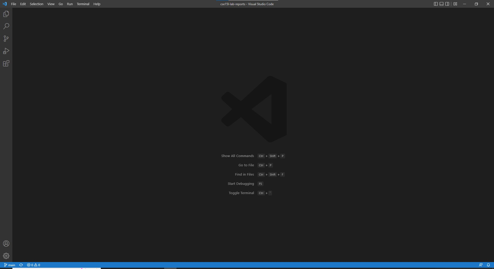

<span style="font-family:Hellvetica; font-size:1em;"> The coloring may be different and can all be changed within the settings. As long as see this blank starting screen, then everything is working. If for some reason you don't see this screen, let one of the tutors in the lab know. </span>

## <span style="color:Magenta"> 2) Installing and Testing SSH </span>

<span style="font-family:Hellvetica; font-size:1em;"> Before we start coding, we have to make sure that the device you're on has SSH installed. If you're on a Windows device then it's easy to figure out. Go to `Settings` --> `Apps` --> `Optional features`.

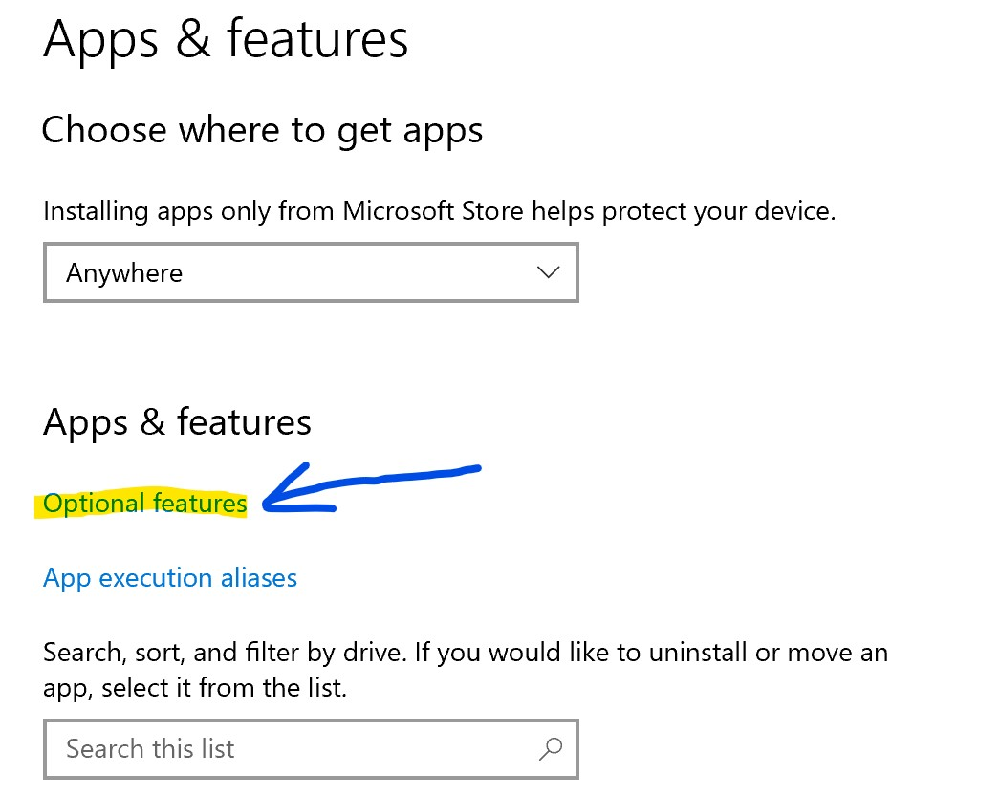

The program you're looking for is OpenSSH which allows the user to connect remotely to other servers. If OpenSSH isn't already installed on your computer, click `Add a feature`, and install OpenSSH. **Make sure you install OpenSSH client NOT the server.**

The next thing you want to have done is getting your CSE15L account information. This can be done by going to [This Link](https://sdacs.ucsd.edu/~icc/index.php) to lookup your account and reset your password.

Code followed by <span style="color:Teal"> Code: </span> is code that's written on your local server. Code followed by <span style="color:Orange"> Code: </span> is code that's written on the remote server.

Now that OpenSS is installed and ready to go, open up VSCode and open up the terminal. You do this by going to the Terminal drop down at the top of the screen and clicking new Terminal. You can also use the keyboard shortcut **Ctrl/Command + `**. 

The command you want to type in is:

<span style="color:Teal"> Code: </span>
```
ssh cs15lfa22kz@ieng6.ucsd.edu
```
**Make sure to replace the last two letters before the @ with the two letters unique to your account username. Mine are `kz` so make sure to replace that with yours.** 

For the first time connecting remotely, you'll receieve a message like this:
```
The authenticity of host 'ieng6.ucsd.edu (128.54.70.227)' can't be established.
RSA key fingerprint is SHA256:ksruYwhnYH+sySHnHAtLUHngrPEyZTDl/1x99wUQcec.
Are you sure you want to continue connecting (yes/no/[fingerprint])? 
```
Type in yes and click enter. After saying yes, you should see a screen like this:

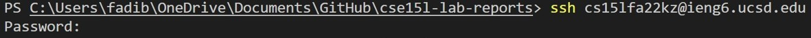

Once you enter your password, you'll get a screen like this. This means that you've successfully logged into the remote server. 

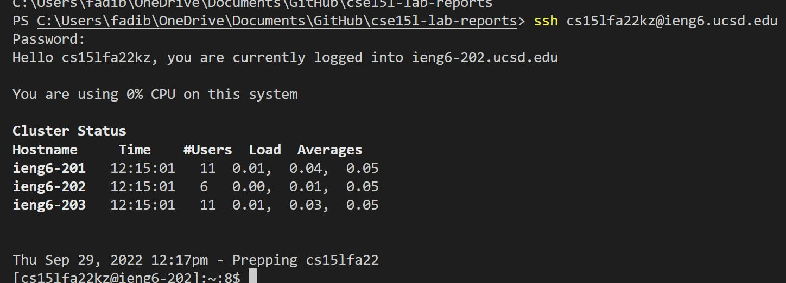

</span>

## <span style="color:Magenta"> 3) Running Commands </span>

<span style="font-family:Hellvetica; font-size:1em;"> Now we will be running some test codes to see how things work. </span>

<span style="color:Orange"> Code: (P.S. you don't need to include the $) </span>

```
$ pwd
```

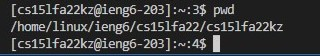

<span style="color:Orange"> Code: </span>

```
$ ls
```

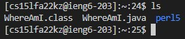

<span style="font-family:Hellvetica; font-size:1em;"> Results printed from running `ls` will differ from what you see for me depending on what files you have remotely. Try running different commands to see what it shows for you. `cd, pwd, mkdir, ls`

<span style="font-family:Hellvetica; font-size:1em;"> When you're ready to exit from the remote server, type:

<span style="color:Orange"> Code: </span>

```
$ exit
```
<span style="font-family:Hellvetica; font-size:1em;"> You'll see a screen like this:

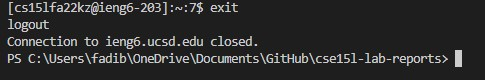

## <span style="color:Magenta"> 4) Copying Files to Remote Servers </span>

<span style="font-family:Hellvetica; font-size:1em;"> So far all we've done is run commands on the remote server. Now we're going transfer over a file from your local server to your remote server. What's nice about this is you don't need to be connected to your remote server in order to transfer a file. </span>

<span style="font-family:Hellvetica; font-size:1em;"> First make a file called **WhereAmI.java** in your local server. Inside the file, copy and paste this code:

<span style="color:Teal"> Code: </span>

```
class WhereAmI {
  public static void main(String[] args) {
    System.out.println(System.getProperty("os.name"));
    System.out.println(System.getProperty("user.name"));
    System.out.println(System.getProperty("user.home"));
    System.out.println(System.getProperty("user.dir"));
  }
}
```
<span style="font-family:Hellvetica; font-size:1em;">In order to compile it, run this command in the Terminal.

<span style="color:Teal"> Code: </span>

```
$ javac WhereAmI.java
```

<span style="font-family:Hellvetica; font-size:1em;">In order to run this file, run this command.

<span style="color:Teal"> Code: </span>

```
$ java WhereAmI
```

<span style="font-family:Hellvetica; font-size:1em;"> It should show you something like this but with information about your own local server.

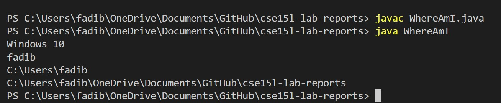

<span style="font-family:Hellvetica; font-size:1em;"> Now that the file is created and ready, you can transfer over your file to the remote server using a command called `scp` </span>

<span style="font-family:Hellvetica; font-size:1em;"> On your local client Terminal, run this command:

<span style="color:Teal"> Code: </span>

```
$ scp WhereAmI.java cs15lfa22kz@ucsd.edu:~/
```
<span style="font-family:Hellvetica; font-size:1em;"> It'll ask you for your password like when you try to login to the remote server. However, after transferring the file, you won't be logged into the remote server. Also, it's important to note the use of the "tilde" symbol or `~` as it allows for us to send the file to the home directory. It should look like this after running the command

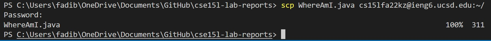

<span style="font-family:Hellvetica; font-size:1em;"> Once the transfer is complete, login to the remote server and run:

<span style="color:Orange"> Code: </span>

```
$ ls
```
<span style="font-family:Hellvetica; font-size:1em;"> You should see WhereAmI.java listed as one of the files under your home directory. To test this file, run the commands:

<span style="color:Orange"> Code: </span>

```
$ javac WhereAmI.java
```

<span style="color:Orange"> Code: </span>

```
$ java WhereAmI
```
<span style="font-family:Hellvetica; font-size:1em;"> It should print out something like this. You can see the difference in the print outcome when you run WhereAmI.java on your local server versus the remote server.

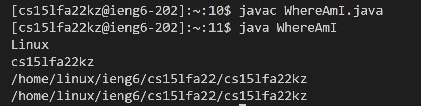

## <span style="color:Magenta"> 5) Creating an SSH Key </span>

<span style="font-family:Hellvetica; font-size:1em;"> This whole time we've been logging into the remote server and having to input a password in order to get in. This takes a lot of time and makes and change inefficient. A useful program to get around this is `ssh keygen`. <span style="font-family:Hellvetica; font-size:1em;"> This creates a link between the remove and local server through public and private keys that allows you to easily get access to the remote server. Think of it as a "Remember me" feature for your passwords on your phone. For your computer only, you can enter a specific passphrase (which can be empty) that allows you to get into the remote server without typing your usual password. First thing you want to type on the command line is:

<span style="color:Teal"> Code: </span>

```
$ ssh-keygen
```

<span style="font-family:Hellvetica; font-size:1em;">It should look something like this:

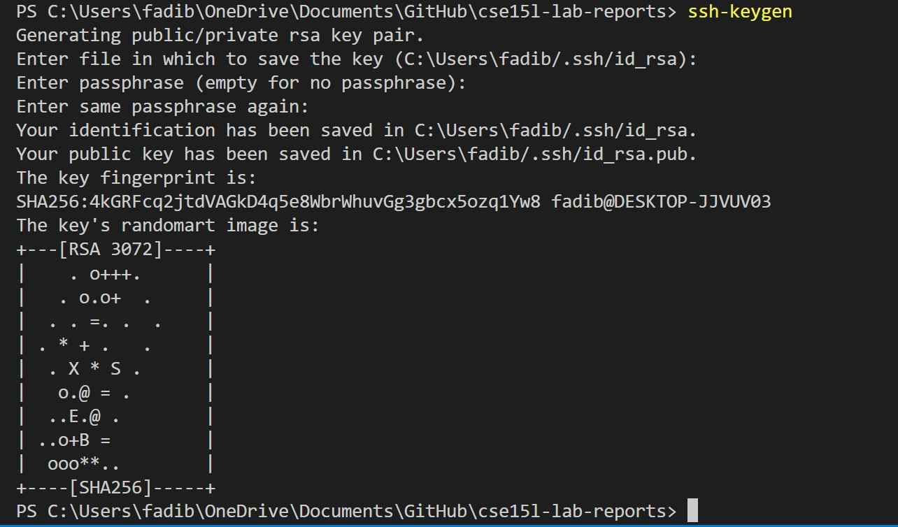

<span style="font-family:Hellvetica; font-size:1em;">Click enter again in order to confirm it in your default path. This has now created two files stored in the
.ssh directory on your server. Now what you need to do is create this directory on your remote server in order to link the two. Make sure you copy over the **public** file to the remote server. In order to do this, you have to first login to your remote server.

<span style="color:Teal"> Code: </span>

```
$ ssh cs15lfa22kz@ieng6.ucsd.edu
```

<span style="font-family:Hellvetica; font-size:1em;"> Once logged in, make a directory called ".ssh". Then just log out.

<span style="color:Orange"> Code: </span>

```
$ mkdir .ssh
```

<span style="font-family:Hellvetica; font-size:1em;"> Once you've logged out, you'll want to set up your passphrase. In order to prompt this, we need to finish the connection. Type in this command in the command line.


<span style="color:Teal"> Code: </span>

```
$ scp /Users/fadib/.ssh/id_rsa.pub cs15lfa22kz@ieng6.ucsd.edu:~/.ssh/authorized_keys
```

<span style="font-family:Hellvetica; font-size:1em;"> Now that your passphrase is set up, you'll be able to quickly log into the remote server in order to make any changes you want without going through the long process of logging in. I recommend that when making a passphrase on your own personal device, make it empty or a single character. That way you won't have to type out a long passphrase when asked to. Otherwise, it wouldn't serve much of a purpose in terms of efficiency.

## <span style="color:Magenta"> 6) Increasing Efficiency </span>

<span style="font-family:Hellvetica; font-size:1em;"> Now that we've finished making a key, it's time to maximize efficiency when it comes to making changes. We can actually run commands to the remote server while still on the client server. This is incredibly useful because it cuts out the whole logging in and logging out process. For instance, if you want to run a new change to the WhereAmI.java file you made previously for the remote server, type this in.

<span style="color:Teal"> Code: </span>

```
$ ssh cs15lfa22kz@ieng6.ucsd.edu "javac WhereAmI.java; java WhereAmI"
```

<span style="font-family:Hellvetica; font-size:1em;"> A few things to note is that when running commands to the remote server while still logged into your local server, you have to have the commands in quotation marks. Also remember to separate all of your commands by a semi-colon. If your password is empty, then you just click enter when asked to enter your passphrase. This will run both commands and will print out WhereAmI.java as if it was in the remote server. In order to really maximize efficiency, you should utitilize the up arrows to traverse through past commands. This saves you the time from typing commands out again. 

## <span style="color:Magenta"> 7) Conclusion </span>
<span style="font-family:Hellvetica; font-size:1em;"> You have now finished setting up SSH and testing it. Work on getting the number of keystrokes down when changing the code. This will save you time and allow you to shoot off changes without taking too long. If you have any problems, feel free to reach out with any questions. I'll be glad to help with any problems you have with SSH.
