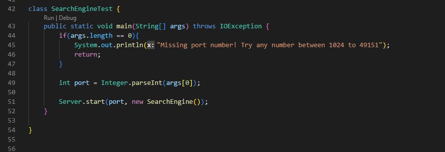
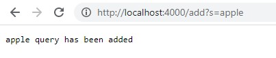
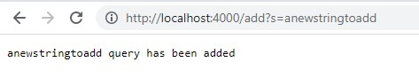
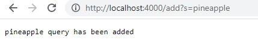
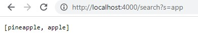
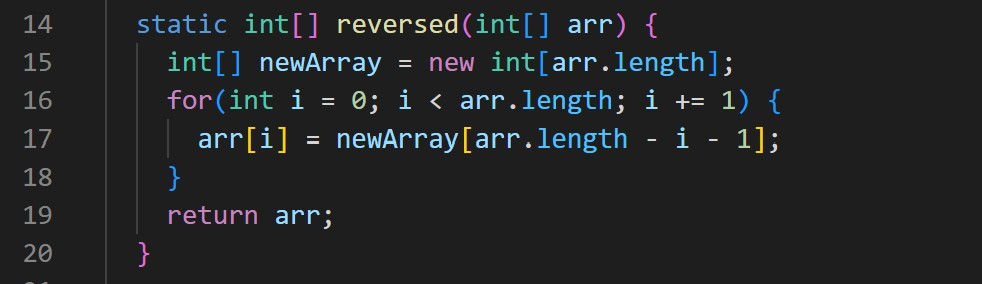
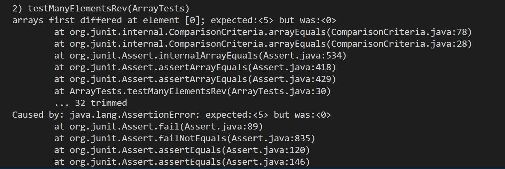
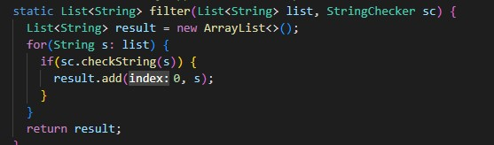
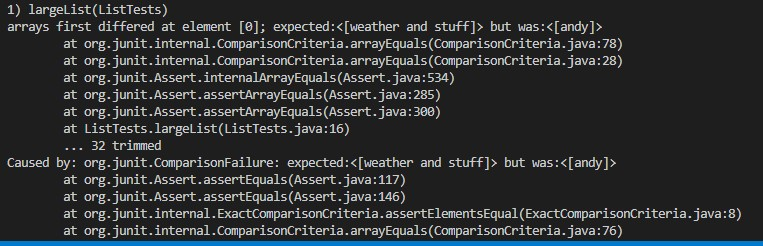

#  Week 3 Lab Report 2 

Welcome to CSE15L Lab Report 2! Today I will be going into two labs that were conducted these past two weeks. In Part One, I'll be showcasing a server file that allows us to create our own local server and test a simple search engine we've created. In Part Two, I'll be showing some code with bugs and process I went through to identify and solve each bug.

##  Part 1: Server Search Engine 
 In Week 2's lab, we worked on creating our own local server. We created a SearchEngine class that allowed us to search queries and paths in order to return a list of what we've searched for. 

 This class implements the handleRequest() method which allows us to either add a query to an arraylist or search for the queries that contain the string that we're searching for. The if statements allow us to search through and see whether we're adding or searching for a string. The way this works is by checking first if the path contains "/add" or if it s "/search". Depending on what it is results in what code is run. For the "/add" portion of the code, we take the query and split it at the equals sign. If the character prior to the equals sign is an "s" then we add the second element of the parameters String array. That adds it to the ArrayList which was instantiated prior. If none of these conditions are met, a "404 Not Found!" message is returned. 

 This is the main method which is run when the command "java SearchEngine 'port'" is run. This method creates a local server which has the port that you input. As you can see in the images below, the url has a port of 4000. If I were to run the server under a new port, that port value will change in the url. 

 In these images, you can see that 3 elements were added. "apple", "anewstringtoadd", and "pineapple". When we use the /search query to find elements containing "app", it'll return the array of [pineapple, apple] because they both have "app" in them. 

##  Part 2: JUnit Testing and Bugs
In ArrayExamples.reversed(), it was supposed to return a new array that has the contents of the input array but in reverse order. There were two identifable bugs in this code. 

There first and most noticable of bugs is that this isn't returning a new array but rather the old one. The second and probably most significant bug is on Line 15. The newArray[] is defined and instantiated to type int and of size arr.length. However, it isn't filled with any elements. So by default, an array of type int is filled with 0 for every empty index. Therefore, when this program is run, it'll only return an array filled with 0s. 

 The input variable was {1, 1, 2, 3, 4, 5}. So the expected value is {5, 4, 3, 2, 1, 1}. However as you can see in the image above, at element[0] it was expected <5> but got <0> instead. This is because of the empty newArray variable being filled with 0s. With my implemented solution, this test along with others all passed. 

 The next bug we examined was in ListExamples.filter(). This was meant to take a List and return that list containing the elements that returned true when passed through StringChecker.checkString(). 

 We're supposed to add the elements back in the original order. However, the line result.add(0,s) shows that they add them in reverse order. By adding to Index 0, you push back all previous elements. So continuously doing so would actually reverse the order of the original List. 

 In a test, I inputed: "swag", "weather and stuff", "and", "andy", "sweet". I expected to get back: "weather and stuff", "and", "andy". However as you can see, I got <[andy]> when the expected for element[0] was <[weather and stuff]>. So the order was infact reversed. The solution to this bug is simple. Instead of overloading .add() by having an index and the String s, you should just use result.add(s). This automatically adds s to the back of the List which preserves the original order. This allows the code to work as intended. 