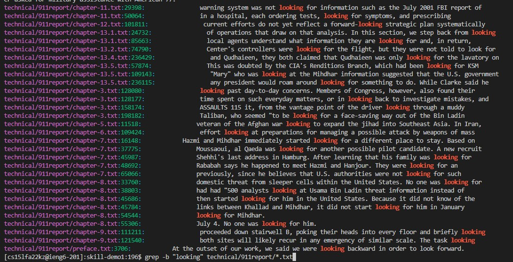
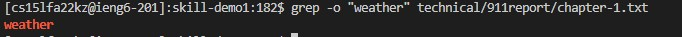

#  Week 5 Lab Report 3 

Welcome to CSE15L Lab Report 3! Today, I'm experimenting with the "grep" command on the command line with the different options that it has.

The grep command is useful for searching a file or multiple files for a given strength and printing that line

As you can see, when I run that command, it prints out the line in that text file that has the string that I'm searching for. In this example, I'm using "weather" which is highlighted orange above. Now that I've tested grep by default, I'm going to start using different command line options that go with grep to see their effect. The first one I'll be looking at is "-b".

What "-b" does with grep is it not only prints out the whole line where the string you're looking for is located, but it prints out the file name (with the directory) and the line number. This is pretty useful when trying to track down the specific areas in a text file that have a word or phrase that you're looking for. Think of this as also like Ctrl+F on a PDF in a web browser.

The next command option I'll be looking at is "-h". 

What "-h" does is printing  out in bulk the text that contains the string you're searching for. This is useful when it comes to identifying and counting how many of that string are present in the txt file or files you're searching for. You can combine this with wc to get a finite answer.

Lastly, I'll be looking into "-o".

What "-o" does it take each string that you're searching for that's present in the file(s) you're searching in and prints it on a line. So if you have a thousand of that string present, it'll print it out a thousand times. Similarly to "-h", this can be very useful for wc in order to get a finite number of how many of that string are present in the files you're searching in.