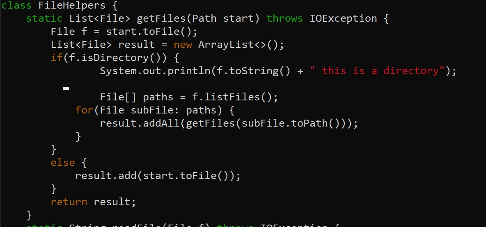
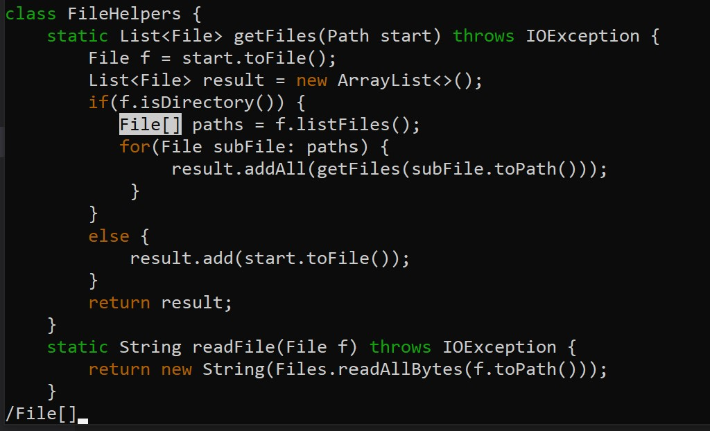
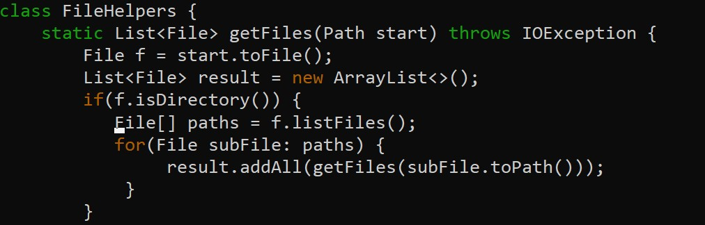
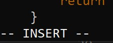
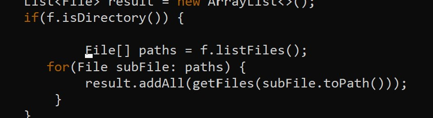
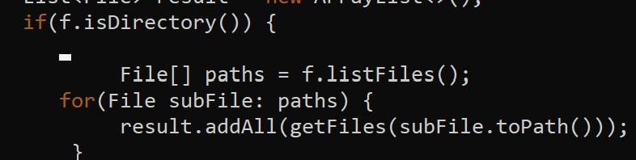
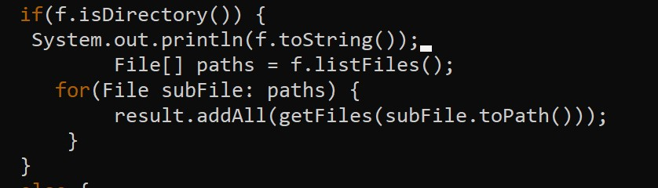
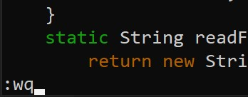

# <span style="color:teal"> Week 7 Lab Report 4 </span>

<span style="font-family:Hellvetica; font-size:1em;">Welcome to CSE15L Lab Report 4! Today we will be examining the VIM command on the different tasks we had in the Week 6 Lab!</span>

<span style="font-family:Hellvetica; font-size:1em;">The task my partner and I had done for the VIM lab is adding a print line before the File[] paths = f.listfiles() line. The process we had for this is as follows after entering vim: "/File", Enter, I, up arrow, System.out.println(f.toString()). Now this process is the most efficient because we were able to jump right to line we needed to print to. However due to the fact that we have to type out System.out.println(f.toString()), keeping this under 30 keystrokes becomes impossible. However, what we had was the most efficient method to add this edit. </span>


<span style="font-family:Hellvetica; font-size:1em;">This image shows the updated file with the print statement for the contents of the file. It's listed above the File[] paths = f.listFiles() line. All of this put together looks like: </span>

```
/File[]
```

<span style="font-family:Hellvetica; font-size:1em;">This image acts as like Ctrl F which jumps the cursor to the line we're looking for which is File[]</span>

```
<Enter>
```

<span style="font-family:Hellvetica; font-size:1em;">After clicking enter, the cursor will be placed on the F for File[]</span>

```
i
```

<span style="font-family:Hellvetica; font-size:1em;">Pressing i will put the user into insert mode which allows you to edit the file's contents by typing and adding stuff in.</span>

```
<Enter>
```

<span style="font-family:Hellvetica; font-size:1em;">By clicking enter, in insert mode, you create a spare line above the line we searched for. That will be the line where we make our edit.</span>

```
<Up Arrow>
```

<span style="font-family:Hellvetica; font-size:1em;">We then use the up arrow once to move the cursor up one line to the line we'll be editing.</span>

```
System.out.println(f.toString());
```


<span style="font-family:Hellvetica; font-size:1em;">We then paste the print command into that line.</span>

```
<Esc>
```
<span style="font-family:Hellvetica; font-size:1em;">Clicking Esc gets the user out of insert mode and back to normal mode.</span>

```
:wq
```


<span style="font-family:Hellvetica; font-size:1em;">This command allows us to save and quit VIM mode. It'll save the edits you've made and put you back into the command line terminal screen, successfully exiting VIM mode.</span>

## <span style="color:Magenta"> Timing Myself</span>

<span style="font-family:Hellvetica; font-size:1em;">Here, I will time myself recreating the same edits that I showed above. I will do them on my local device and scp the file over. I will also do the change on the remote server using vim. From there I'll decide which is better to use.</span>

<span style="font-family:Hellvetica; font-size:1em;">When doing these changes on my local server, it takes approximately 37 seconds from no change to the file being run using bash scripting it on ssh remote server. </span>

<span style="font-family:Hellvetica; font-size:1em;">
For the VIM server, from the moment I enter VIM mode, it takes 21 seconds to add the change, save and quit from VIM mode, and running the command on bash scripting.</span>

<span style="font-family:Hellvetica; font-size:1em;">
Overall if I had to choose which style I'd prefer, that decision would depend on the task that I'm doing. VIM is more useful when it comes to quick changes. For tasks like we did above where we had one simple change, VIM is more useful and efficient. It allows for quick changes to be made. For example, if there's a missing semi-colon, or every time you test something and there's one error in a line that you constantly have to change, VIM is better. In those instances, I'd use VIM. However, for tasks that take more time like making a full file, I'd prefer editing it on the local server. It's easier to navigate, manipulate, and format on the local. After completing that, I'd scp it over to the remote.</span>

<span style="font-family:Hellvetica; font-size:1em;">
Overall, I'd use local for the larger tasks that make up the bulk of the file. Once I'm making small changes and debugging the code, I'd prefer to use VIM.</span>
