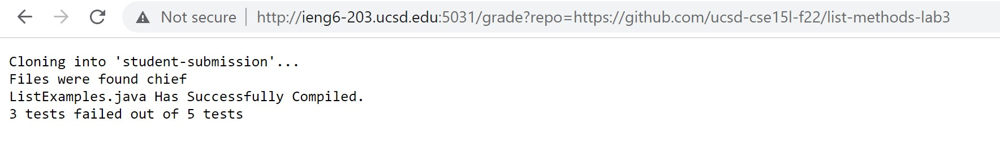
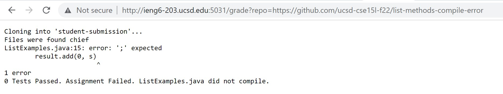
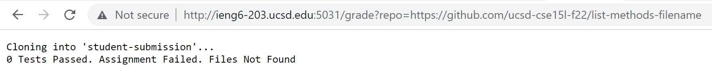

# <span style="color:teal"> Week 8 Lab Report 5 </span>

<span style="font-family:Hellvetica; font-size:1em;">Welcome to CSE15L Lab Report 5! Today we will be making an autograder with a bash script for the repositories from Week 3 Lab.</span>

<span style="font-family:Hellvetica; font-size:1em;">Below, I've included the code of the grade.sh block. </span>

```
CPATH=".:lib/hamcrest-core-1.3.jar:lib/junit-4.13.2.jar"
# set -e

rm -rf student-submission
mkdir student-submission

git clone $1 student-submission

if test -f student-submission/ListExamples.java;
then
    echo "Files were found chief"
else
    echo "0 Tests Passed. Assignment Failed. Files Not Found"
    exit 39
fi


cp TestListExamples.java student-submission
cp -r lib student-submission
cd student-submission

javac ListExamples.java
if [[ $? != 0 ]]
then 
    echo "0 Tests Passed. Assignment Failed. ListExamples.java did not compile."
    exit 
else   
    echo "ListExamples.java Has Successfully Compiled."
fi

javac -cp $CPATH *.java

java -cp $CPATH org.junit.runner.JUnitCore TestListExamples | grep "Tests run:" > results.txt

NUMS=(`grep -o '[0-9]' results.txt`)
TOTAL=${NUMS[0]}
FAILED=${NUMS[1]}
echo "$FAILED tests failed out of $TOTAL tests"
```

<span style="font-family:Hellvetica; font-size:1em;">Within this code, I start by removing any directories called "student-submission". After which I clone the input repository into a new directory called "student-submission". The first if statement uses "-f" to see if the right files are in that repository we just cloned. We then use another if statement to check if that ListExamples.java file we cloned compiles. The next chunk uses stderr output to count how many tests fail out of how many tests there are.</span>



<span style="font-family:Hellvetica; font-size:1em;">This screenshot shows the test results of running the "list-methods-lab3-autograder" repository. This repository is ment to have multiple bugs which the tests I've made have picked up. It shows that there are 5 tests that were run. 3 of those tests failed. This was printed out directly after submitting. </span>



<span style="font-family:Hellvetica; font-size:1em;">In this screenshot, this is an example of the grade.sh script handling the ListExamples.java file not compiling. It'll print the error and the grade will be a 0 since the file does not compile. </span>



<span style="font-family:Hellvetica; font-size:1em;">In this screenshot, we demonstrate what will happen if the ListExamples.java file is not contained within the repository we've cloned. It'll fail the assignment immediately and have 0 tests passed. </span>

## <span style="color:Magenta"> Tracing the Script</span>

<span style="font-family:Hellvetica; font-size:1em;">Here we will trace the script code for the "list-methods-lab3-autograder" repository to see how script works and how it gets to producing the output it does. </span>

<span style="font-family:Hellvetica; font-size:1em;">The first thing that happens is we create a variable called "CPATH". This will be used to when compiling and running the files from the directory.</span>
```
CPATH=".:lib/hamcrest-core-1.3.jar:lib/junit-4.13.2.jar"
```

<span style="font-family:Hellvetica; font-size:1em;">We follow this up by removing any directories called "student-submission". This is to clear any files within that directory from the last time we ran this script. </span>
```
rm -rf student-submission
```
<span style="font-family:Hellvetica; font-size:1em;">The exit code for this is 0 since there is no error when running this command.</span>

<span style="font-family:Hellvetica; font-size:1em;">The next command is to make a directory called "student-submission". This is the directory in which the repository is cloned into.</span>
```
mkdir student-submission
```
<span style="font-family:Hellvetica; font-size:1em;">The exit code for this is 0 since there is no error when running this command. There is no stderr since this runs with no error.</span>

<span style="font-family:Hellvetica; font-size:1em;">This command will clone the first argument in running the bash script which is the repository link. It'll clone the repository into the newly created directory: "student-submission".</span>
```
git clone $1 student-submission
```
<span style="font-family:Hellvetica; font-size:1em;">Since the link is a valid link, it'll successfully clone and print Clone Successful. Following this, the exit code is 0 since there was no error in running this command.</span>

```
if test -f student-submission/ListExamples.java;
then
    echo "Files were found chief"
else
    echo "0 Tests Passed. Assignment Failed. Files Not Found"
    exit 39
fi
```
<span style="font-family:Hellvetica; font-size:1em;"> We then go through this if statement. This checks if the repository we cloned has the file we're looking for. It tests if "-f student-submission/ListExamples.java" is true. This command checks if the file exists. If it does, it'll echo "Files were found chief". Since this file is found, it'll echo that statement and move on out of the if statement. There is no early exit here.</span>


<span style="font-family:Hellvetica; font-size:1em;">We then cp the TestListExamples.java file (which has all of our junit tests) to the directory that has the newly cloned repository.</span>
```
cp TestListExamples.java student-submission
```
<span style="font-family:Hellvetica; font-size:1em;">There is no stderr and the exit code following this command is 0.</span>

<span style="font-family:Hellvetica; font-size:1em;">We then cp the entire library directory into the student-submission directory. This'll allows us to compile the TestListExamples.java file and run the file, grading the repository.</span>
```
cp -r lib student-submission
```
<span style="font-family:Hellvetica; font-size:1em;">There is no stderr and the exit code following this command is 0.</span>

<span style="font-family:Hellvetica; font-size:1em;">We finally cd into the student-submission directory to begin running the test files.</span>
```
cd student-submission
```
<span style="font-family:Hellvetica; font-size:1em;">There is no stderr and the exit code following this command is 0.</span>

<span style="font-family:Hellvetica; font-size:1em;">This command will attempt to compile ListExamples.java. It'll have an exit code of 0 if it compiles.</span>
```
javac ListExamples.java
```
<span style="font-family:Hellvetica; font-size:1em;">There is no stderr and the exit code following this command is 0 since the file compiles successfully.</span>

<span style="font-family:Hellvetica; font-size:1em;">This if statement block is used to check if ListExamples.java compiled successfully. It checks the exit code after running the compile command above.</span>
```
if [[ $? != 0 ]]
then 
    echo "0 Tests Passed. Assignment Failed. ListExamples.java did not compile."
    exit 
else   
    echo "ListExamples.java Has Successfully Compiled."
fi
```
<span style="font-family:Hellvetica; font-size:1em;">Since ListExamples.java in this repository successfully compiled, it'll skip the first if statement block and go to the else block. It'll print "ListExamples.java Has Successfully Compiled. There is no stderr and the exit code is 0.</span>

<span style="font-family:Hellvetica; font-size:1em;">The next line will compile all the other files within that directory (TestListExamples.java). </span>

```
javac -cp $CPATH *.java
```
<span style="font-family:Hellvetica; font-size:1em;">Since this compiles, the exit code will be 0. There is no stderr since there are no errors with running this command. </span>

<span style="font-family:Hellvetica; font-size:1em;">This command will run the TestListExamples file. Every instance of a junit test being run will be thrown into the results.txt file. </span>
```
java -cp $CPATH org.junit.runner.JUnitCore TestListExamples | grep "Tests run:" > results.txt
```
<span style="font-family:Hellvetica; font-size:1em;">There is no stderr since this command runs with no error. The exit code is 0. The stdout will be every test that is run. This file has 5 tests. All 5 tests will be thrown into results.txt</span>

<span style="font-family:Hellvetica; font-size:1em;">This next line will output the number of instances of "[0-9]" into the NUMS variable. </span>
```
NUMS=(`grep -o '[0-9]' results.txt`)
```
<span style="font-family:Hellvetica; font-size:1em;">There is no stderr with this line so the exit code remains 0. </span>

<span style="font-family:Hellvetica; font-size:1em;">This next line is used to keep track of the total number of tests there are. They used the index 0 because that keeps track of how many instances of junit tests occur. </span>

```
TOTAL=${NUMS[0]}
```
<span style="font-family:Hellvetica; font-size:1em;">There is no stderr with this line so the exit code remains 0. </span>

<span style="font-family:Hellvetica; font-size:1em;">The FAILED variable is made in order to keep track of the number of JUnit tests that didn't pass. These are the exceptions. </span>
```
FAILED=${NUMS[1]}
```
<span style="font-family:Hellvetica; font-size:1em;">There is no stderr with this line. It'll run without issue.</span>

<span style="font-family:Hellvetica; font-size:1em;">Lastly, we print the total score of the repository. It'll use echo to print how many tests failed out of how many total tests there are.</span>
```
echo "$FAILED tests failed out of $TOTAL tests"
```
<span style="font-family:Hellvetica; font-size:1em;">There is no stderr with this line. It'll run without issue.</span>